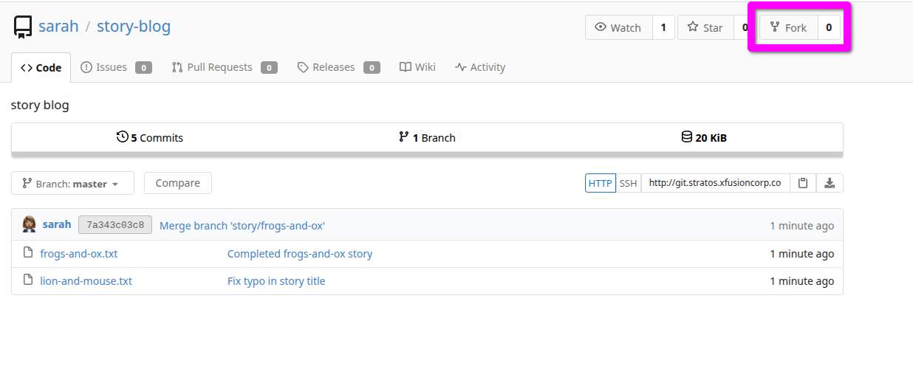
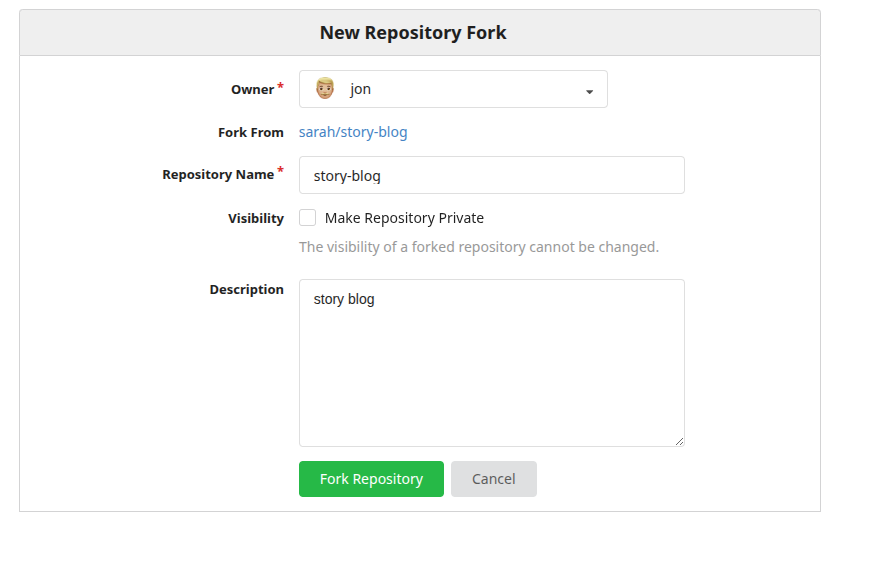

## Intro

Welcome back all to another post in the 100 Days of DevOps series! This post is going to be much lighter on content than the previous two for the most part - a lot of the `git` tasks ahead are straightforward ones and don't require as much explanation or troubleshooting as some of the server setup we've been doing. Even so, it's still great knowledge - if you enjoy this post, make sure to check out the first two from the series button at the top and bottom of this page.

It's also worth noting that this post is currently a work-in-progress - you may see some quick notes from me completing the challenges. As I work through writing them up, they'll turn into a much nicer writeup - promise!

With that, let's start knocking down some `git` tasks!

> [!IMPORTANT]+ Spoiler alert!
> In case you're squeamish about this sort of thing, there are a bunch of spoilers ahead - proceed at your own (self-learning) risk. I'll be diving into the nitty-gritty behind solutions where I can, so hopefully you'll be able to learn a thing or two.  
> 
> It's also worth noting that if you're working alongside me, you'll see different users, IP addresses, passwords, or even completely different solutions occasionally - they rotate these with each challenge spawn on most challenges.
{icon="circle-info"}

## Day 21: Set Up Git Repository on Storage Server

> [!QUOTE]+ Problem Prompt
> The Nautilus development team has provided requirements to the DevOps team for a new application development project, specifically requesting the establishment of a Git repository. Follow the instructions below to create the Git repository on the Storage server in the Stratos DC:  
>  
> 1. Utilize yum to install the git package on the Storage Server.  
> 2. Create a bare repository named /opt/games.git (ensure exact name usage).  
{icon="circle-question"}

This one's pretty straightforward - all we have to do is initialize a bare git repo. First, SSH to the server and check if `git` is installed; if not, use `dnf` or `yum` to install it:

```console
[natasha@ststor01 ~]$ dnf list --installed | grep git
crontabs.noarch                                1.11-26.20190603git.el9          @baseos          
crypto-policies.noarch                         20251126-1.gite9c4db2.el9        @System          
crypto-policies-scripts.noarch                 20251126-1.gite9c4db2.el9        @System          
exempi.x86_64                                  2.6.0-0.2.20211007gite23c213.el9 @appstream
[natasha@ststor01 ~]$ sudo dnf install -y git
[...]
Dependencies resolved.
=================================================================================================================
 Package                        Architecture         Version                       Repository               Size
=================================================================================================================
Installing:
 git                            x86_64               2.52.0-1.el9                  appstream                39 k
[...]
Installed:
  git-2.52.0-1.el9.x86_64                git-core-2.52.0-1.el9.x86_64         git-core-doc-2.52.0-1.el9.noarch   
  less-590-6.el9.x86_64                  perl-Error-1:0.17029-7.el9.noarch    perl-Git-2.52.0-1.el9.noarch       
  perl-TermReadKey-2.38-11.el9.x86_64    perl-lib-0.65-483.el9.x86_64        

Complete!
```

Then, we navigate to the directory and initialize a bare git repo!
```console
[natasha@ststor01 ~]$ cd /opt
[natasha@ststor01 ~]$ sudo git init --bare games.git
hint: Using 'master' as the name for the initial branch. This default branch name
hint: will change to "main" in Git 3.0. To configure the initial branch name
hint: to use in all of your new repositories, which will suppress this warning,
hint: call:
hint:
hint:   git config --global init.defaultBranch <name>
hint:
hint: Names commonly chosen instead of 'master' are 'main', 'trunk' and
hint: 'development'. The just-created branch can be renamed via this command:
hint:
hint:   git branch -m <name>
hint:
hint: Disable this message with "git config set advice.defaultBranchName false"
Initialized empty Git repository in /opt/games.git/
```

## Day 22: Clone Git Repository on Storage Server

> [!QUOTE]+ Problem Prompt
> The DevOps team established a new Git repository last week, which remains unused at present. However, the Nautilus application development team now requires a copy of this repository on the Storage Server in the Stratos DC. Follow the provided details to clone the repository:
> 
> 1. The repository to be cloned is located at /opt/cluster.git  
> 2. Clone this Git repository to the /usr/src/kodekloudrepos directory. Perform this task using the natasha user, and ensure that no modifications are made to the repository or existing directories, such as changing permissions or making unauthorized alterations.
{icon="circle-question"}

This is another straightforward one - SSH into the storage server as `natasha`, and just clone the repository like shown:

```console
[natasha@ststor01 ~]$ cd /usr/src/kodekloudrepos/
[natasha@ststor01 kodekloudrepos]$ git clone /opt/news.git
Cloning into 'news'...
warning: You appear to have cloned an empty repository.
done.
```

And verifying the repo was cloned:
```console
[natasha@ststor01 kodekloudrepos]$ ls -la
total 16
drwxr-xr-x 3 natasha natasha 4096 Jul 16 13:50 .
drwxr-xr-x 1 root    root    4096 Jul 16 13:46 ..
drwxr-xr-x 3 natasha natasha 4096 Jul 16 13:50 news
```

Two easy ones down - on to Day 23!

## Day 23: Fork a Git Repository

> [!QUOTE]+ Problem Prompt
> There is a Git server utilized by the Nautilus project teams. Recently, a new developer named Jon joined the team and needs to begin working on a project. To begin, he must fork an existing Git repository. Follow the steps below:
>  
> 1. Click on the Gitea UI button located on the top bar to access the Gitea page.
> 2. Login to Gitea server using username jon and password Jon_pass123.  
> 3. Once logged in, locate the Git repository named sarah/story-blog and fork it under the jon user.
>  
> Note: For tasks requiring web UI changes, screenshots are necessary for review purposes. Additionally, consider utilizing screen recording software such as loom.com to record and share your task completion process.
{icon="circle-question"}

This one should be very easy - all of the work will be done via the Gitea UI, no CLI necessary. 

First, sign in as `jon` on the site - once you're at `jon`'s dashboard, click "Explore" in the top menu. It should pull up a listing of all of the public repositories on the Gitea instance; in that list, you should see one labeled `sarah/story-blog`.

Next, we'll go to create a fork of the `sarah/story-blog` repo by clicking the hyperlink to it and once it loads, clicking the "Fork" button in the top-right of the UI:



It should bring up a modal to create a new fork - all of the default information should be fine for our purposes. The grader shouldn't look for anything specific, only the presence of the forked repository.



Once you click the "Fork Repository" button, it'll create a clone of the repository in its current state under `jon`'s account. To verify it worked, navigate back to the main dashboard by clicking the green Gitea logo in the upper-left corner of the site. Instead of a blank page, you should now see a listing of the repositories under `jon`'s account on the right - including one named `jon/story-blog`.

## Day 24: Git Create Branches

> [!QUOTE]+ Problem Prompt
> Nautilus developers are actively working on one of the project repositories, /usr/src/kodekloudrepos/ecommerce. Recently, they decided to implement some new features in the application, and they want to maintain those new changes in a separate branch. Below are the requirements that have been shared with the DevOps team:
> 
> On Storage server in Stratos DC create a new branch xfusioncorp_ecommerce from master branch in /usr/src/kodekloudrepos/ecommerce git repo.  
> Please do not try to make any changes in the code.
{icon="circle-question"}

This one is a pretty foundational skill - being able to create feature branches is part-and-parcel to keeping development clean between a team that's all flying to get features pushed out as soon as possible. It helps you keep you developing on your piece of the functionality while minimizing conflicts, allowing others to modify the same file you're working on without either of you overwriting each other's code.

As with lots of Linux commands, the first stop will be the `man` page. It's a little lengthy, but here it is if you're curious:

```man
git checkout [<branch>]
    To prepare for working on <branch>, switch to it by updating the index and the files in the working
    tree, and by pointing HEAD at the branch. Local modifications to the files in the working tree are
    kept, so that they can be committed to the <branch>.

    If <branch> is not found but there does exist a tracking branch in exactly one remote (call it
    <remote>) with a matching name and --no-guess is not specified, treat as equivalent to

        $ git checkout -b <branch> --track <remote>/<branch>

    You could omit <branch>, in which case the command degenerates to "check out the current branch",
    which is a glorified no-op with rather expensive side-effects to show only the tracking
    information, if it exists, for the current branch.
```

Let's set up some branching! First, we change into the `ecommerce` local repo, checking the current status:

```console
[natasha@ststor01 ~]$ cd /usr/src/kodekloudrepos/ecommerce/
[natasha@ststor01 ecommerce]$ sudo git branch
* kodekloud_ecommerce
  master
```

Now we need to add our branch, basing it on the `master` branch and verifying the switch:

```console
[natasha@ststor01 ecommerce]$ sudo git checkout -b xfusioncorp_ecommerce master
Switched to a new branch 'xfusioncorp_ecommerce'
[natasha@ststor01 ecommerce]$ sudo git branch
  kodekloud_ecommerce
  master
* xfusioncorp_ecommerce
```

That's it!

## Day 25: Git Merge Branches

> [!QUOTE]+ Problem Prompt
> The Nautilus application development team has been working on a project repository /opt/official.git. This repo is cloned at /usr/src/kodekloudrepos on storage server in Stratos DC. They recently shared the following requirements with DevOps team:
> 
> Create a new branch devops in /usr/src/kodekloudrepos/official repo from master and copy the /tmp/index.html file (present on storage server itself) into the repo. Further, add/commit this file in the new branch and merge back that branch into master branch. Finally, push the changes to the origin for both of the branches.
{icon="circle-question"}

This is the next evolution of Day 24 - now that we can _create_ branches, we need to know how to perform work on them, and eventually merge them back into the main branch when we're finished.

We start by moving into our repo and creating a new branch `devops`.

```console
[natasha@ststor01 ~]$ cd /usr/src/kodekloudrepos/official/
[natasha@ststor01 official]$ sudo git checkout -b devops master
Switched to a new branch 'devops'
```

Now that we've got a shiny new branch, we simulate having done some development work by copying in the new `index.html` file. In order to eventually perform the push and merge our work, we have to track the file with a `git add` to stage it, and then a `git commit`:

```console
[natasha@ststor01 official]$ sudo cp /tmp/index.html .
[natasha@ststor01 official]$ sudo git add .
[natasha@ststor01 official]$ sudo git commit -m "Adding index.html"
[devops eb98f18] Adding index.html
 1 file changed, 1 insertion(+)
 create mode 100644 index.html
```

Now we're set up to do the merge. The `man` page for `git merge` has a great diagram (and explanation) of what we're trying to accomplish. Since we're the only person working on this pseudo-repo, we're not going to encounter any merge conflicts - it should end up cleanly merged after all is said and done.

```man
Incorporates changes from the named commits (since the time their histories diverged from the current
       branch) into the current branch. This command is used by git pull to incorporate changes from another
       repository and can be used by hand to merge changes from one branch into another.

       Assume the following history exists and the current branch is master:

                     A---B---C topic
                    /
               D---E---F---G master

       Then git merge topic will replay the changes made on the topic branch since it diverged from master
       (i.e., E) until its current commit (C) on top of master, and record the result in a new commit along
       with the names of the two parent commits and a log message from the user describing the changes. Before
       the operation, ORIG_HEAD is set to the tip of the current branch (C).

                     A---B---C topic
                    /         \
               D---E---F---G---H master

       A merge stops if there’s a conflict that cannot be resolved automatically or if --no-commit was
       provided when initiating the merge. At that point you can run git merge --abort or git merge
       --continue.
```

With the explanation piece out of the way, let's actually try out merging the branches. We switch to the branch we're merging _into_, in this case `master`, and then merge our feature branch:

```console
[natasha@ststor01 official]$ sudo git checkout master
Switched to branch 'master'
Your branch is up to date with 'origin/master'.
[natasha@ststor01 official]$ sudo git merge devops
Updating d784e64..eb98f18
Fast-forward
 index.html | 1 +
 1 file changed, 1 insertion(+)
 create mode 100644 index.html
```

As expected, no merge conflicts were encountered. Now all we have left to do is push the changes to update the upstream on what just happened:

```console
[natasha@ststor01 official]$ sudo git push
Enumerating objects: 4, done.
Counting objects: 100% (4/4), done.
Delta compression using up to 16 threads
Compressing objects: 100% (2/2), done.
Writing objects: 100% (3/3), 334 bytes | 334.00 KiB/s, done.
Total 3 (delta 0), reused 0 (delta 0), pack-reused 0 (from 0)
To /opt/official.git
   d784e64..eb98f18  master -> master
```

## Day 26: Git Manage Remotes

> [!QUOTE] Problem Prompt
> The xFusionCorp development team added updates to the project that is maintained under /opt/beta.git repo and cloned under /usr/src/kodekloudrepos/beta. Recently some changes were made on Git server that is hosted on Storage server in Stratos DC. The DevOps team added some new Git remotes, so we need to update remote on /usr/src/kodekloudrepos/beta repository as per details mentioned below:
> 
> a. In /usr/src/kodekloudrepos/beta repo add a new remote dev_beta and point it to /opt/xfusioncorp_beta.git repository.  
> b. There is a file /tmp/index.html on same server; copy this file to the repo and add/commit to master branch.  
> c. Finally push master branch to this new remote origin.
{icon="circle-question"}

asdf

```
thor@jumphost ~$ ssh natasha@ststor01
[natasha@ststor01 ~]$ cd /usr/src/kodekloudrepos/beta/
```

from the man page:
```
git remote add [-t <branch>] [-m <master>] [-f] [--[no-]tags] [--mirror=(fetch|push)] <name> <URL>
```

so:
```
[natasha@ststor01 ~]$ sudo git remote add dev_beta /opt/xfusioncorp_beta.git
[natasha@ststor01 beta]$ sudo cp /tmp/index.html .
[natasha@ststor01 beta]$ sudo git add .
[natasha@ststor01 beta]$ sudo git commit -m "Adding index.html"
[natasha@ststor01 beta]$ sudo git push -u dev_beta master
```

## Day 27: Git Revert Some Changes

> [!QUOTE] Problem Prompt
> The Nautilus application development team was working on a git repository /usr/src/kodekloudrepos/blog present on Storage server in Stratos DC. However, they reported an issue with the recent commits being pushed to this repo. They have asked the DevOps team to revert repo HEAD to last commit. Below are more details about the task:  
>  
> In /usr/src/kodekloudrepos/blog git repository, revert the latest commit ( HEAD ) to the previous commit (JFYI the previous commit hash should be with initial commit message ).  
> Use revert blog message (please use all small letters for commit message) for the new revert commit.
{icon="circle-question"}

asdf

thor@jumphost ~$ ssh natasha@ststor01
[natasha@ststor01 ~]$ cd /usr/src/kodekloudrepos/blog
[natasha@ststor01 blog]$ sudo git log

```
commit 8091cb525cd626f2c2622cf717e94195c747ed8c (HEAD -> master, origin/master)
Author: Admin <admin@kodekloud.com>
Date:   Sat Jan 3 23:11:31 2026 +0000

    add data.txt file

commit 8b1e383b13b2125811cc02461360c2b1b7241750
Author: Admin <admin@kodekloud.com>
Date:   Sat Jan 3 23:11:31 2026 +0000

    initial commit
```

```
[natasha@ststor01 blog]$ sudo git reset 8b1e383b13b2125811cc02461360c2b1b7241750
Unstaged changes after reset:
D       info.txt

[natasha@ststor01 blog]$ sudo git add .
[natasha@ststor01 blog]$ sudo git commit -m 'revert blog
```

And....failure.

### Learning the difference - HEAD vs `COMMIT ID`

So what went wrong? According to other solutions out there, I needed to use `sudo git revert HEAD` instead of resetting to the original commit message. If we do that, the output will change drastically.

Remember that our original `git log` only had two lines - the initial commit, and the update for removing the content. After resetting the HEAD, running `git log` now shows the following:

```
[natasha@ststor01 official]$ sudo git revert HEAD
[master 0fdb64d] revert official
 1 file changed, 1 insertion(+)
 create mode 100644 info.txt
[natasha@ststor01 official]$ sudo git log
commit 0fdb64d3e1e7ad82d879ccc0caed8c7b1e4c17b6 (HEAD -> master)
Author: Admin <admin@kodekloud.com>
Date:   Wed Jan 7 01:40:03 2026 +0000

    revert official

commit 44a26504b7c96c7fb0900466d7b87ca03082df1a (origin/master)
Author: Admin <admin@kodekloud.com>
Date:   Wed Jan 7 01:37:32 2026 +0000

    add data.txt file

commit 18b21f2009dbd84f1a1be51deee96badef6307df
Author: Admin <admin@kodekloud.com>
Date:   Wed Jan 7 01:37:32 2026 +0000

    initial commit
```

Where I screwed up: `git revert` is not the same as `git reset`. `git revert` adds a new commit that counteracts the changes you messed up on, whereas `git reset` completely moves the commit history back and nukes the new changes entirely. The most likely scenario is that the grader is running its own `git log` and comparing line-by-line with something like `diff`, so I was getting it wrong for not having the "incorrect" commit entry still in the log.

So it looks like that difference between reverting and resetting matters after all. That's something I haven't encountered before really, as all of my projects tend to be linear in nature and only involve my own code - so resetting, reverting, and other more complex operations aren't things I usually need to work with. This is why practical, hands-on exercises matter - I wouldn't have necessarily hit this distinction on my own experimenting!

## Day 28: Git Cherry Pick

> [!QUOTE] Problem Prompt
> The Nautilus application development team has been working on a project repository /opt/apps.git. This repo is cloned at /usr/src/kodekloudrepos on storage server in Stratos DC. They recently shared the following requirements with the DevOps team:  
>  
> There are two branches in this repository, master and feature. One of the developers is working on the feature branch and their work is still in progress, however they want to merge one of the commits from the feature branch to the master branch, the message for the commit that needs to be merged into master is Update info.txt. Accomplish this task for them, also remember to push your changes eventually.  
{icon="circle-question"}

thor@jumphost ~$ ssh natasha@ststor01
[natasha@ststor01 ~]$ cd /usr/src/kodekloudrepos/apps

man page:
```
Given one or more existing commits, apply the change each one introduces, recording a new commit for
       each. This requires your working tree to be clean (no modifications from the HEAD commit).
```

let's get our log:
```
[natasha@ststor01 apps]$ sudo git log
commit e2c27dcd57e253a7eebb5eb13befd6ba4f5cb452 (HEAD -> feature, origin/feature)
Author: Admin <admin@kodekloud.com>
Date:   Wed Jan 7 01:49:27 2026 +0000

    Update welcome.txt

commit f68f61382afe508e4dcea80408030e6c592b3eed
Author: Admin <admin@kodekloud.com>
Date:   Wed Jan 7 01:49:27 2026 +0000

    Update info.txt

commit b69e74ecfb48d16535c88807829f8fd813eda5f4 (origin/master, master)
Author: Admin <admin@kodekloud.com>
Date:   Wed Jan 7 01:49:27 2026 +0000

    Add welcome.txt

commit ba446b72988839df2d5026a0d9e028f5e365bd2f
Author: Admin <admin@kodekloud.com>
Date:   Wed Jan 7 01:49:27 2026 +0000

    initial commit
```

so the commit in question is f68f61382afe508e4dcea80408030e6c592b3eed

if you try to `git cherry-pick` from here, it'll give an error that there's no message and that you're cherry-picking blanks:
```
[natasha@ststor01 apps]$ sudo git cherry-pick f68f61382afe508e4dcea80408030e6c592b3eed
On branch feature
You are currently cherry-picking commit f68f613.
  (all conflicts fixed: run "git cherry-pick --continue")
  (use "git cherry-pick --skip" to skip this patch)
  (use "git cherry-pick --abort" to cancel the cherry-pick operation)

nothing to commit, working tree clean
The previous cherry-pick is now empty, possibly due to conflict resolution.
If you wish to commit it anyway, use:

    git commit --allow-empty

Otherwise, please use 'git cherry-pick --skip'
```

checking our status to see which branch we're on (should've done this first):
```
[natasha@ststor01 apps]$ sudo git status
On branch feature
nothing to commit, working tree clean
```

switching over:
```
[natasha@ststor01 apps]$ sudo git checkout master
Switched to branch 'master'
warning: cancelling a cherry picking in progress
Your branch is up to date with 'origin/master'.
```
finally, we merge:
```
[natasha@ststor01 apps]$ sudo git cherry-pick f68f61382afe508e4dcea80408030e6c592b3eed
[master 76c73ae] Update info.txt
 Date: Wed Jan 7 01:49:27 2026 +0000
 1 file changed, 1 insertion(+), 1 deletion(-)

[natasha@ststor01 apps]$ sudo git push
Enumerating objects: 5, done.
Counting objects: 100% (5/5), done.
Delta compression using up to 16 threads
Compressing objects: 100% (2/2), done.
Writing objects: 100% (3/3), 315 bytes | 315.00 KiB/s, done.
Total 3 (delta 0), reused 0 (delta 0), pack-reused 0 (from 0)
To /opt/apps.git
   b69e74e..76c73ae  master -> master
```

checking our `git log`:
```
[natasha@ststor01 apps]$ sudo git log
commit 76c73ae00c3468baae335769d2121c7385317040 (HEAD -> master, origin/master)
Author: Admin <admin@kodekloud.com>
Date:   Wed Jan 7 01:49:27 2026 +0000

    Update info.txt

commit b69e74ecfb48d16535c88807829f8fd813eda5f4
Author: Admin <admin@kodekloud.com>
Date:   Wed Jan 7 01:49:27 2026 +0000

    Add welcome.txt

commit ba446b72988839df2d5026a0d9e028f5e365bd2f
Author: Admin <admin@kodekloud.com>
Date:   Wed Jan 7 01:49:27 2026 +0000

    initial commit
```

we see commit # `76c73ae00c3468baae335769d2121c7385317040` has our changes

## Day 29: Manage Git Pull Requests

> [!QUOTE] Problem Prompt
> Max want to push some new changes to one of the repositories but we don't want people to push directly to master branch, since that would be the final version of the code. It should always only have content that has been reviewed and approved. We cannot just allow everyone to directly push to the master branch. So, let's do it the right way as discussed below:  
> 
> SSH into storage server using user max, password Max_pass123 . There you can find an already cloned repo under Max user's home.  
> Max has written his story about The 🦊 Fox and Grapes 🍇  
> Max has already pushed his story to remote git repository hosted on Gitea branch story/fox-and-grapes  
> Check the contents of the cloned repository. Confirm that you can see Sarah's story and history of commits by running git log and validate author info, commit message etc.  
> Max has pushed his story, but his story is still not in the master branch. Let's create a Pull Request(PR) to merge Max's story/fox-and-grapes branch into the master branch  
> Click on the Gitea UI button on the top bar. You should be able to access the Gitea page.  
> UI login info:  
> - Username: max  
> - Password: Max_pass123  
> PR title : Added fox-and-grapes story  
> PR pull from branch: story/fox-and-grapes (source)  
> PR merge into branch: master (destination)  
> 
> Before we can add our story to the master branch, it has to be reviewed. So, let's ask tom to review our PR by assigning him as a reviewer  
> Add tom as reviewer through the Git Portal UI  
> Go to the newly created PR  
> Click on Reviewers on the right  
> Add tom as a reviewer to the PR  
> 
> Now let's review and approve the PR as user Tom  
> Login to the portal with the user tom  
> Logout of Git Portal UI if logged in as max  
> UI login info:  
> - Username: tom  
> - Password: Tom_pass123  
> PR title : Added fox-and-grapes story  
> Review and merge it.  
> 
> Great stuff!! The story has been merged! 👏  
> 
> Note: For these kind of scenarios requiring changes to be done in a web UI, please take screenshots so that you can share it with us for review in case your task is marked incomplete. You may also consider using a screen recording software such as loom.com to record and share your work.
{icon="circle-question"}

```
max $ ls
story-blog
max $ cd story-blog
max (story/fox-and-grapes)$

max (story/fox-and-grapes)$ git log
commit 4d362f4283deea113e6f58309101e36016ef416f
Author: max <max@stratos.xfusioncorp.com>
Date:   Wed Jan 7 02:08:20 2026 +0000

    Added fox-and-grapes story

commit b13ac147732b637cd5b9c313c1ee489f5eb5499c
Merge: 1052664 125de9f
Author: sarah <sarah@stratos.xfusioncorp.com>
Date:   Wed Jan 7 02:08:18 2026 +0000

    Merge branch 'story/frogs-and-ox'

commit 1052664a65fa790b86d11b07751e541574bc2510
Author: sarah <sarah@stratos.xfusioncorp.com>
Date:   Wed Jan 7 02:08:18 2026 +0000

    Fix typo in story title

commit 125de9f83724184c9d88b409e37c814b1dcd393e
Author: sarah <sarah@stratos.xfusioncorp.com>
Date:   Wed Jan 7 02:08:18 2026 +0000

    Completed frogs-and-ox story

commit 6e2ceae7a7f459d09e7567ee2434526ee3b1d40e
Author: sarah <sarah@stratos.xfusioncorp.com>
Date:   Wed Jan 7 02:08:18 2026 +0000

    Added the lion and mouse story

commit d388733b54d5a42f435fe14a177e315879e2209f
Author: sarah <sarah@stratos.xfusioncorp.com>
Date:   Wed Jan 7 02:08:18 2026 +0000

    Add incomplete frogs-and-ox story
```

sign in on gitea
repositories > sarah/story-blog
click Pull Requests > New Pull Request
Choose the branch Max was working on, then click "Create New Pull Request"
Add tom as a reviewer
sign out of max, into tom
DO NOT click notification bell, go to PR directly
click green "merge" button and you're all set

## Day 30: Git Hard Reset

> [!QUOTE] Problem Prompt
> The Nautilus application development team was working on a git repository /usr/src/kodekloudrepos/official present on Storage server in Stratos DC. This was just a test repository and one of the developers just pushed a couple of changes for testing, but now they want to clean this repository along with the commit history/work tree, so they want to point back the HEAD and the branch itself to a commit with message add data.txt file. Find below more details:  
> 
> In /usr/src/kodekloudrepos/official git repository, reset the git commit history so that there are only two commits in the commit history i.e initial commit and add data.txt file.  
> Also make sure to push your changes.
{icon="circle-question"}

```
thor@jumphost ~$ ssh natasha@ststor01
[natasha@ststor01 ~]$ cd /usr/src/kodekloudrepos/official
[natasha@ststor01 official]$ sudo git log
commit e475ea5e82059667a342273885174fa4fb1e11a2 (HEAD -> master, origin/master)
Author: Admin <admin@kodekloud.com>
Date:   Wed Jan 7 02:29:36 2026 +0000

    Test Commit10

commit bdc9d21a58e0c87307219ff3f98c6e075bdd5f18
Author: Admin <admin@kodekloud.com>
Date:   Wed Jan 7 02:29:36 2026 +0000

    Test Commit9

commit c8f63e58e23b286573c95c3cc29e8cc1e5217ca1
Author: Admin <admin@kodekloud.com>
Date:   Wed Jan 7 02:29:36 2026 +0000

    Test Commit8

commit 7a9667ea44f1306004bd0929f3e78313ef9da08f
Author: Admin <admin@kodekloud.com>
Date:   Wed Jan 7 02:29:36 2026 +0000

    Test Commit7

commit e7bd406bf72552f28c3011c8f16d3569025c86d2
Author: Admin <admin@kodekloud.com>
Date:   Wed Jan 7 02:29:36 2026 +0000

    Test Commit6

commit bc2947950f882fc211c0e0411de4fc46e0d56a91
Author: Admin <admin@kodekloud.com>
Date:   Wed Jan 7 02:29:36 2026 +0000

    Test Commit5

commit 30ea441ee9097732192369ad194bbebf00fb9ab1
Author: Admin <admin@kodekloud.com>
Date:   Wed Jan 7 02:29:36 2026 +0000

    Test Commit4

commit 66564e836bc7c7d604351cd62a6ffd8c6077e157
Author: Admin <admin@kodekloud.com>
Date:   Wed Jan 7 02:29:36 2026 +0000

    Test Commit3

commit 851aff537eab13411f4c44d499b1ae3d51712e7a
Author: Admin <admin@kodekloud.com>
Date:   Wed Jan 7 02:29:36 2026 +0000

    Test Commit2

commit 34667bd931c36972fee5a74b762805d952c31df8
Author: Admin <admin@kodekloud.com>
Date:   Wed Jan 7 02:29:36 2026 +0000

    Test Commit1

commit 3775f3f928e4466406192c3d9a7bf976828f8d62
Author: Admin <admin@kodekloud.com>
Date:   Wed Jan 7 02:29:36 2026 +0000

    add data.txt file

commit b07c59b6c811e0b180000b8367204de7960d4a97
Author: Admin <admin@kodekloud.com>
Date:   Wed Jan 7 02:29:36 2026 +0000

    initial commit
```


target commit: 3775f3f928e4466406192c3d9a7bf976828f8d62

```
[natasha@ststor01 official]$ sudo git reset 3775f3f928e4466406192c3d9a7bf976828f8d62
[natasha@ststor01 official]$ sudo git log
commit 3775f3f928e4466406192c3d9a7bf976828f8d62 (HEAD -> master)
Author: Admin <admin@kodekloud.com>
Date:   Wed Jan 7 02:29:36 2026 +0000

    add data.txt file

commit b07c59b6c811e0b180000b8367204de7960d4a97
Author: Admin <admin@kodekloud.com>
Date:   Wed Jan 7 02:29:36 2026 +0000

    initial commit
```

[natasha@ststor01 official]$ sudo git push -f

Explanation of `-f`:
> The -f is actually required because of the rebase. Whenever you do a rebase you would need to do a force push because the remote branch cannot be fast-forwarded to your commit. You'd always want to make sure that you do a pull before pushing, but if you don't like to force push to master or dev for that matter, you can create a new branch to push to and then merge or make a PR.

https://stackoverflow.com/questions/39399804/updates-were-rejected-because-the-tip-of-your-current-branch-is-behind-its-remot